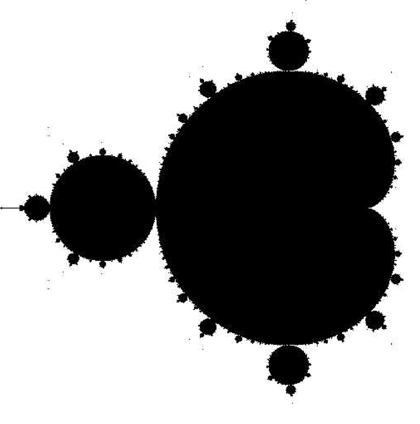
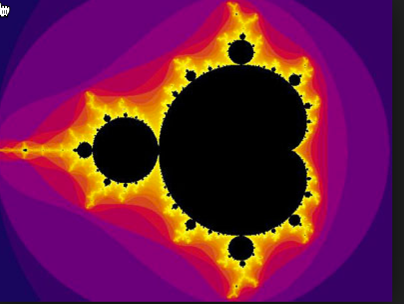
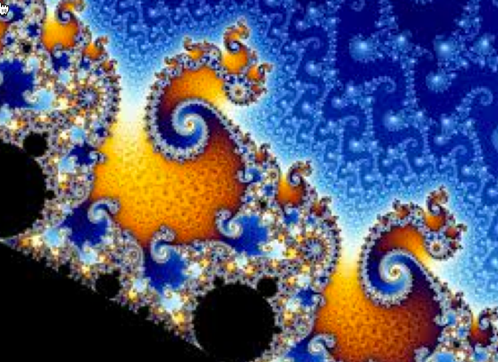

The Mandlebrot Set
##################

The mathematician `Benoit Mandlebrot
<https://en.wikipedia.org/wiki/Benoit_Mandelbrot>`_, studied the properties of
complex numbers and discovered an interesting phenomena about them. His
discovery led to the creation of Mandlebrot images, so named by `Adrien Douady
<https://en.wikipedia.org/wiki/Adrien_Douady>`_ in honor of Mandlebrot's work.
These images are easy to generate, and result in very cool graphics images.
Furthermore, the calculations needed to produce these images are an ideal
candidate for exploring modern graphics hardware and parallel processing
techniques. In short, they are worth a bit of study by any computer science
student!

Complex Numbers
***************

A complex number is one that has a "real" part and an "imaginary" part. The
real part is just some floating point number. The imaginary part is another
floating point number multiplied by the square root of -1. Now, every math
student knows you cannot take the square root of -1, but if you could we would
name it "i" and call it imaginary! We multiply "i" by some floating point
number, add it to a real number and we get a complex number!

..  math::

    {z} = {A} + {B}{i}

Plotting Complex Numbers
************************

Complex numbers have some pretty cool applications in engineering, science and
math. We will not go into that here. What we will do it plot these numbers on a
graph.

If we use the real part of a complex number to specify some "X" value on a graph, and
the imaginary part of a complex number to point to some "Y" value on that graph, we can place
any complex number somewhere on a conventional X-Y graph. The origin of this
X-Y coordinate system corresponds to the complex number 0 + 0i.

The length of a line from the origin of the graph to the point is called the
``magnitude`` of the complex number. It is calculated using this formula:

..  math::

    | z | =  | {A + Bi} | = \sqrt{A^2 + B^2}

Complex Number Math
*******************

We can use the normal rules of math to figure out the basic math operations on
complex numbers. All we need to remember is that :math:`i^2 = -1`!

When we work with these numbers, we do normal math, except when we multiply
things together. If we ever generate :math:`u^2`, we replace that with -1.

Adding complex numbers is simple:

..  math::

    ({A} + {B}{i}) + ({C} + {D}{i}) = ({A + C}) + ({B + D}){i}

Multiplying two complex numbers gives us this:

..  math::

    ({A} + {B}{i})({C} + {D}{i}) = {AC} + {AD}{i} + {BC}{i} + {BD}{i^2}

    = ({AC - BD}) + ({AD +BC}){i}

Mandlebrot Sets
***************

Mandlebrot's discovery was pretty amazing. All he did was to take any point on
the complex plain and use that number to do a simple calculation using
something called a mathematical series. 

Basically, you start with one number, plug it into the formula for the series
to generate a new complex number. You plug this new number back into the same
formula and generate a third complex number. Keep repeating this process as
long as you like (computers are great at this!).

Mandlebrot's series formula was this:

..  image:: MandleBrotFormula.png
    :align: center

Mandlebrot calculated the magnitude of the complex numbers and discovered that
some headed off to infinity, and some did not. Those that headed off to
infinity he tossed out, those that stayed bounded he included in a mathematical
"set" of numbers. To keep this simple, he used integer numbers for his
calculations.

When he plotted those that stayed bounded in his set, he came up with a picture that looked like this:

Wild, huh! His discovery started a bunch of folks off studying what was going
on, and how to visualize it better.

Every black point is a complex number that stayed bounded. Every white point is
a complex number that headed off to infinity!

Cooler Images
*************

Eventually folks came up with a way to generate even cooler images. They
counted the number of iterations (passes through the formula) and watched the
magnitude of the numbers the series generated. If the magnitude keep growing
larger, they recorded the count when the magnitude exceeded some magnitude like
2.0. They used this number in a variety of creative ways to generate a color.
If the complex number was part of Mandlebrot's set, they colored that spot
black.

Then they started seeing images that looked like this:

This finding started a revolution in computer graphics studies. Playing with the
color scheme, and zooming around on this image, magnifying it as you go can
result in some amazing images. Like this, for example:

Parallel Processing
*******************

Generating a color for every pixel on a computer screen involves working
through Mandlebrot's series in a loop and watching what happens. The math
involved in this process is completely self contained. It depends on nothing
but that initial value for the complex number represented by a single point on
the graph. That means if we have a ton of processors around, each could be
processing a single pixel color at the same time. Well, except for computers
like the Yosemite Supercomputer in Cheyenne, Wyoming, which has 77,000
processors, most of us only have a few cores in our computers, but we have many
processing elements on our graphics cards. If we could figure out how to tap
into that system, we could generate these images pretty fast.

That is exactly what computer science students have been doing for years now,
as a way to explore the GPU in your system.

Perhaps we could explore that in our class, or maybe in a future class!

..  vim:filetype=rst spell:
